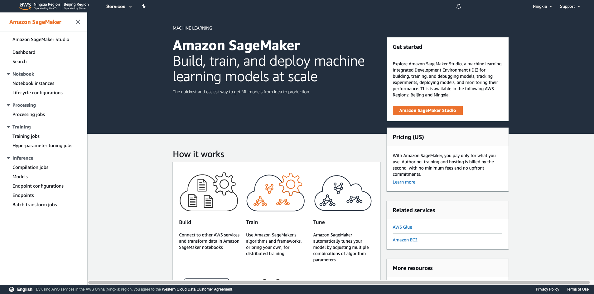
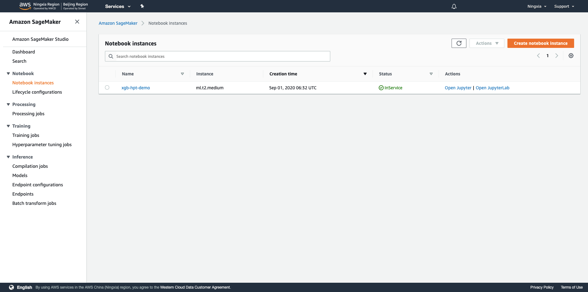
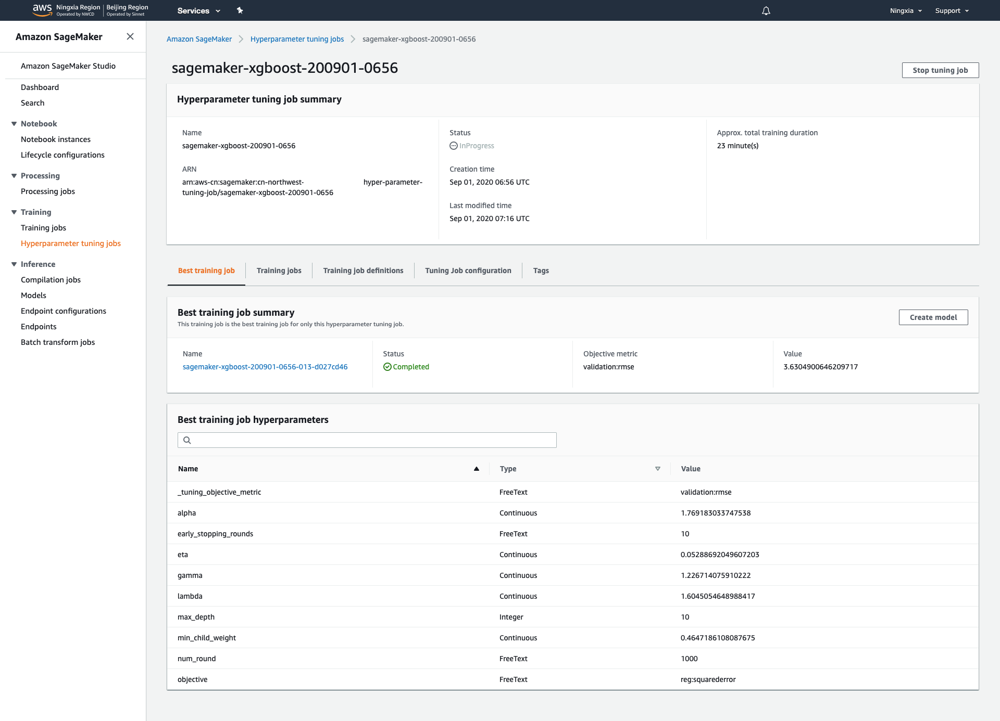

# 高阶12 AWS SageMaker Hyperparameter Tuning 初试

> Xinrui (Alan) Zhou

## 背景

数据分析两大主要任务：特征工程和调参。AWS SageMaker Hyperparameter Tuning恰好提供了极佳的调参工具，作为初学者的我，把我的学习经历分享一下。使用的XGBoost模型适合包括突变筛选、Biomarker以及生存预后分析在内的各种生物医学表格型数据的处理和挖掘。初试就用机器学习领域著名的数据集——Boston数据集来演示，文中代码从SageMaker Examples中整理并结合自身数据挖掘经验经调试而得。

## 方法

1.从AWS Management Console进入SageMaker



2.选择左侧Notebook Instances


3.选择右上角橙色Create notebook instance进入创建Notebook实例的界面，输入实例名称，选择实例类型（选择最小的就好，调试环境不需要很高算力），IAM Role创建一个AmazonSageMaker-ExecutionRole即可


4.稍作等待，实例创建需要一些时间


5.等到Status从Pending变成InService，选择偏好的Notebook环境进入（Jupyter Notebook或者Jupyter Lab），如果里面空空如也，可以右上方点击New创建一个新记事本，根据你想要的ML框架选择，这里选择 `conda_python3`




6.导入各种之后需要的各种packages，设置好pandas显示以及bokeh画图输出

```python
import os
from pprint import pprint

import bokeh
import bokeh.io
import boto3
import pandas as pd
import sagemaker
from bokeh.models import HoverTool
from bokeh.plotting import figure, show
from sagemaker.amazon.amazon_estimator import get_image_uri
from sagemaker.tuner import (ContinuousParameter, HyperparameterTuner,
                             IntegerParameter)
from sklearn.datasets import load_boston
from sklearn.model_selection import train_test_split

pd.set_option('display.max_colwidth', None)
bokeh.io.output_notebook()
```

__[by DC] 如果有报错`ValueError: Value must have type '<class 'int'>'`, 用这个命令：pd.set_option('display.max_colwidth', -1)__

7.加载Boston数据集，查看数据集描述

```python
data = load_boston()
print(data['DESCR'])
```

```md
.. _boston_dataset:

Boston house prices dataset
---------------------------

**Data Set Characteristics:**  

    :Number of Instances: 506

    :Number of Attributes: 13 numeric/categorical predictive. Median Value (attribute 14) is usually the target.

    :Attribute Information (in order):
        - CRIM     per capita crime rate by town
        - ZN       proportion of residential land zoned for lots over 25,000 sq.ft.
        - INDUS    proportion of non-retail business acres per town
        - CHAS     Charles River dummy variable (= 1 if tract bounds river; 0 otherwise)
        - NOX      nitric oxides concentration (parts per 10 million)
        - RM       average number of rooms per dwelling
        - AGE      proportion of owner-occupied units built prior to 1940
        - DIS      weighted distances to five Boston employment centres
        - RAD      index of accessibility to radial highways
        - TAX      full-value property-tax rate per $10,000
        - PTRATIO  pupil-teacher ratio by town
        - B        1000(Bk - 0.63)^2 where Bk is the proportion of blacks by town
        - LSTAT    % lower status of the population
        - MEDV     Median value of owner-occupied homes in $1000's

    :Missing Attribute Values: None

    :Creator: Harrison, D. and Rubinfeld, D.L.

This is a copy of UCI ML housing dataset.
https://archive.ics.uci.edu/ml/machine-learning-databases/housing/


This dataset was taken from the StatLib library which is maintained at Carnegie Mellon University.

The Boston house-price data of Harrison, D. and Rubinfeld, D.L. 'Hedonic
prices and the demand for clean air', J. Environ. Economics & Management,
vol.5, 81-102, 1978.   Used in Belsley, Kuh & Welsch, 'Regression diagnostics
...', Wiley, 1980.   N.B. Various transformations are used in the table on
pages 244-261 of the latter.

The Boston house-price data has been used in many machine learning papers that address regression
problems.

.. topic:: References

   - Belsley, Kuh & Welsch, 'Regression diagnostics: Identifying Influential Data and Sources of Collinearity', Wiley, 1980. 244-261.
   - Quinlan,R. (1993). Combining Instance-Based and Model-Based Learning. In Proceedings on the Tenth International Conference of Machine Learning, 236-243, University of Massachusetts, Amherst. Morgan Kaufmann.
```

8.读取数据，写csv文件，Amazon SageMaker需要使用首列是target且无header的csv文件作为输入，这里按7:3分train和validation两个文件作为训练和验证，加上random_state在调试时可以复现结果

```python
X = pd.DataFrame(data['data'])
y = pd.Series(data['target'])
df = pd.concat([y, X], axis=1)
df_train, df_valid = train_test_split(df, test_size=0.3, random_state=2020)
df_train.to_csv('train.csv', index=False, header=False)
df_valid.to_csv('validation.csv', index=False, header=False)
```

9.使用boto3和sagemaker建立相应sagemaker和s3连接

```python
region = boto3.Session().region_name
smclient = boto3.Session().client('sagemaker')

role = sagemaker.get_execution_role()

bucket = sagemaker.Session().default_bucket()
prefix = 'sagemaker/xgb-hpt-demo'
```

10.把train.csv和validation.csv传至s3，会出现在s3的这个地方`s3://sagemaker-cn-northwest-1-accountid/sagemaker/`,作为input

```python
boto3.Session().resource('s3').Bucket(bucket).Object(
    os.path.join(prefix, 'train/train.csv')
).upload_file('train.csv')
boto3.Session().resource('s3').Bucket(bucket).Object(
    os.path.join(prefix, 'validation/validation.csv')
).upload_file('validation.csv')
```

11.使用sagemaker建立XGBoost的训练任务，训练模型可以使用算力高一点的实例类型，Boston数据集目标是regression问题，使用reg:squarederror作为目标函数，XGBoost会默认使用rmse作为loss function，（这里可以启用spot来节省成本，通过设置train_use_spot_instances为True以及train_max_wait即可）

```python
sess = sagemaker.Session()

container = get_image_uri(region, 'xgboost', repo_version='1.0-1')

xgb = sagemaker.estimator.Estimator(
    container,
    role,
    train_instance_count=1,
    train_instance_type='ml.m4.xlarge',
    output_path=f's3://{bucket}/{prefix}/output',
    sagemaker_session=sess
)

xgb.set_hyperparameters(
    objective='reg:squarederror',
    num_round=1000,
    early_stopping_rounds=10
)
```

12.设置想要探索的超参范围，连续值使用ContinuousParameter，整数值使用IntegerParameter，以下参数介绍摘自[XGBoost Parameters](https://xgboost.readthedocs.io/en/latest/parameter.html)，探索范围皆为测试，实际使用取值范围会有所调整

- ```eta(learning_rate)```: Step size shrinkage used in update to prevents overfitting. After each boosting step, we can directly get the weights of new features, and eta shrinks the feature weights to make the boosting process more conservative.

- ```gamma(min_split_loss)```: Minimum loss reduction required to make a further partition on a leaf node of the tree. The larger gamma is, the more conservative the algorithm will be.

- ```max_depth```: Maximum depth of a tree. Increasing this value will make the model more complex and more likely to overfit. 0 is only accepted in lossguided growing policy when tree_method is set as hist and it indicates no limit on depth. Beware that XGBoost aggressively consumes memory when training a deep tree.

- ```min_child_weight```: Minimum sum of instance weight (hessian) needed in a child. If the tree partition step results in a leaf node with the sum of instance weight less than min_child_weight, then the building process will give up further partitioning. In linear regression task, this simply corresponds to minimum number of instances needed to be in each node. The larger min_child_weight is, the more conservative the algorithm will be.

- ```lambda(reg_lambda)```: L2 regularization term on weights. Increasing this value will make model more conservative.

- ```alpha(reg_alpha)```: L1 regularization term on weights. Increasing this value will make model more conservative.

```python
hyperparameter_ranges = {
    'eta': ContinuousParameter(0, 1),
    'gamma': ContinuousParameter(0, 2),
    'max_depth': IntegerParameter(2, 10),
    'min_child_weight': ContinuousParameter(0, 10),
    'lambda': ContinuousParameter(0, 2),
    'alpha': ContinuousParameter(0, 2),
}
```

13.设置最终训练目标是minimize validation集上rmse的值，探索方法是Bayesian，相比Random Search更加高效和智能，max_jobs限制超参调优最大进行的任务数，max_parallel_jobs限制最大同时进行的任务数（如需扩充需联系AWS进行调整）

```python
objective_metric_name = 'validation:rmse'
tuner = HyperparameterTuner(
    xgb,
    objective_metric_name,
    hyperparameter_ranges,
    strategy='Bayesian',
    objective_type='Minimize',
    max_jobs=40,
    max_parallel_jobs=4
)
```

14.开始调优！

```python
s3_input_train = sagemaker.s3_input(
    s3_data=f's3://{bucket}/{prefix}/train/',
    content_type='csv'
)
s3_input_validation = sagemaker.s3_input(
    s3_data=f's3://{bucket}/{prefix}/validation/',
    content_type='csv'
)

tuner.fit(
    {
        'train': s3_input_train,
        'validation': s3_input_validation
    },
    include_cls_metadata=False
)
```

15.SageMaker界面上选择左边Hyperparameter tuning jobs，在Training jobs选项卡下可以查看当前进行的所有任务


16.Best training job选项卡下可以查看当前最优的参数组合



17.点击单个调优任务可以查看任务详情以及模型存放地址


18.除了SageMaker界面，回到Notebook里依然可以查询任务进行状态，InProgress或Completed，tuning_job_name设置成Hyperparameter Tuning任务的名称

```python
tuning_job_name = 'sagemaker-xgboost-200901-0656'

smclient.describe_hyper_parameter_tuning_job(
    HyperParameterTuningJobName=tuning_job_name
)['HyperParameterTuningJobStatus']
```

```md
Completed
```

## 结果

1.收集任务信息和最佳调优结果

```python
tuning_job_result = smclient.describe_hyper_parameter_tuning_job(
    HyperParameterTuningJobName=tuning_job_name)

job_count = tuning_job_result['TrainingJobStatusCounters']['Completed']
print(f'{job_count} training jobs have completed')

is_minimize = (tuning_job_result['HyperParameterTuningJobConfig']
               ['HyperParameterTuningJobObjective']['Type'] != 'Maximize')
objective_name = tuning_job_result['HyperParameterTuningJobConfig']['HyperParameterTuningJobObjective']['MetricName']

if tuning_job_result.get('BestTrainingJob', None):
    print('Best model found so far:')
    pprint(tuning_job_result['BestTrainingJob'])
else:
    print('No training jobs have reported results yet.')
```

```md
40 training jobs have completed
Best model found so far:
{'CreationTime': datetime.datetime(2020, 9, 1, 15, 27, 39, tzinfo=tzlocal()),
 'FinalHyperParameterTuningJobObjectiveMetric': {'MetricName': 'validation:rmse',
                                                 'Value': 3.531749963760376},
 'ObjectiveStatus': 'Succeeded',
 'TrainingEndTime': datetime.datetime(2020, 9, 1, 15, 31, 5, tzinfo=tzlocal()),
 'TrainingJobArn': 'arn:aws-cn:sagemaker:cn-northwest-:training-job/sagemaker-xgboost-200901-0656-035-5d0f5aea',
 'TrainingJobName': 'sagemaker-xgboost-200901-0656-035-5d0f5aea',
 'TrainingJobStatus': 'Completed',
 'TrainingStartTime': datetime.datetime(2020, 9, 1, 15, 29, 58, tzinfo=tzlocal()),
 'TunedHyperParameters': {'alpha': '0.671831959528788',
                          'eta': '0.37772700838669704',
                          'gamma': '1.909270228253972',
                          'lambda': '1.5938633750550917',
                          'max_depth': '8',
                          'min_child_weight': '0.9382415600275175'}}
```

2.查看所有任务的参数设置和结果，以DataFrame呈现

```python
tuner = sagemaker.HyperparameterTuningJobAnalytics(tuning_job_name)

full_df = tuner.dataframe()

if len(full_df) > 0:
    df = full_df[full_df['FinalObjectiveValue'] > -float('inf')]
    if len(df) > 0:
        df = df.sort_values('FinalObjectiveValue', ascending=is_minimize)
        print(f'Number of training jobs with valid objective: {len(df)}')
        print(
            {
                'lowest': min(df['FinalObjectiveValue']),
                'highest': max(df['FinalObjectiveValue'])
            }
        )
    else:
        print('No training jobs have reported valid results yet.')
df
```

```md
Number of training jobs with valid objective: 40
{'lowest': 3.531749963760376, 'highest': 22.929479598999023}
```

3.绘图

```python
class HoverHelper():

    def __init__(self, tuning_analytics):
        self.tuner = tuning_analytics

    def hovertool(self):
        tooltips = [
            ('FinalObjectiveValue', '@FinalObjectiveValue'),
            ('TrainingJobName', '@TrainingJobName'),
        ]
        for k in self.tuner.tuning_ranges.keys():
            tooltips.append((k, f'@{k}'))

        ht = HoverTool(tooltips=tooltips)
        return ht

    def tools(self, standard_tools='pan,crosshair,wheel_zoom,zoom_in,zoom_out,undo,reset'):
        return [self.hovertool(), standard_tools]


hover = HoverHelper(tuner)
ranges = tuner.tuning_ranges
figures = []
for hp_name, hp_range in ranges.items():
    categorical_args = {}
    if hp_range.get('Values'):
        # This is marked as categorical. Check if all options are actually numbers.
        def is_num(x):
            try:
                float(x)
                return 1
            except:
                return 0
        vals = hp_range['Values']
        if sum([is_num(x) for x in vals]) == len(vals):
            # Bokeh has issues plotting a categorical range that's actually numeric, so plot as numeric
            print(
                f'Hyperparameter {hp_name} is tuned as categorical, but all values are numeric')
        else:
            # Set up extra options for plotting categoricals. A bit tricky when they're actually numbers.
            categorical_args['x_range'] = vals

    # Now plot it
    p = figure(plot_width=500, plot_height=500,
               title=f'Objective vs {hp_name}',
               tools=hover.tools(),
               x_axis_label=hp_name, y_axis_label=objective_name,
               **categorical_args)
    p.circle(source=df, x=hp_name, y='FinalObjectiveValue')
    figures.append(p)
show(bokeh.layouts.Column(*figures))
```


4.关闭Notebook实例！

> Last but not least.

回到Notebook Instances中，选择相应的实例，Stop掉，避免持续扣费。


