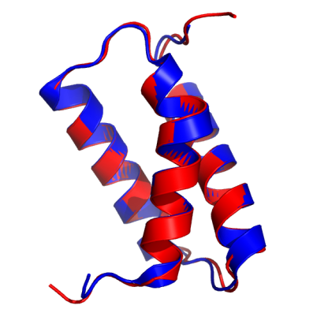
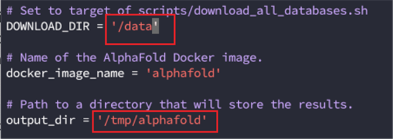
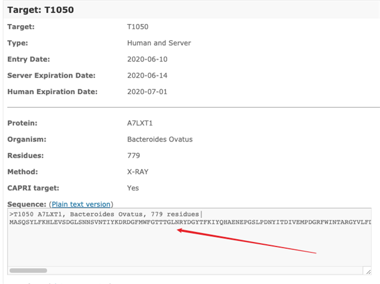
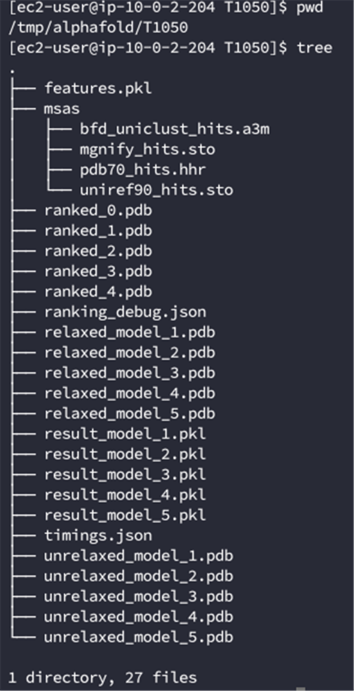
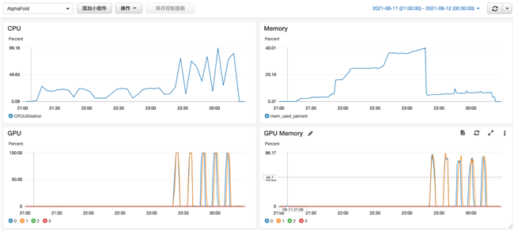
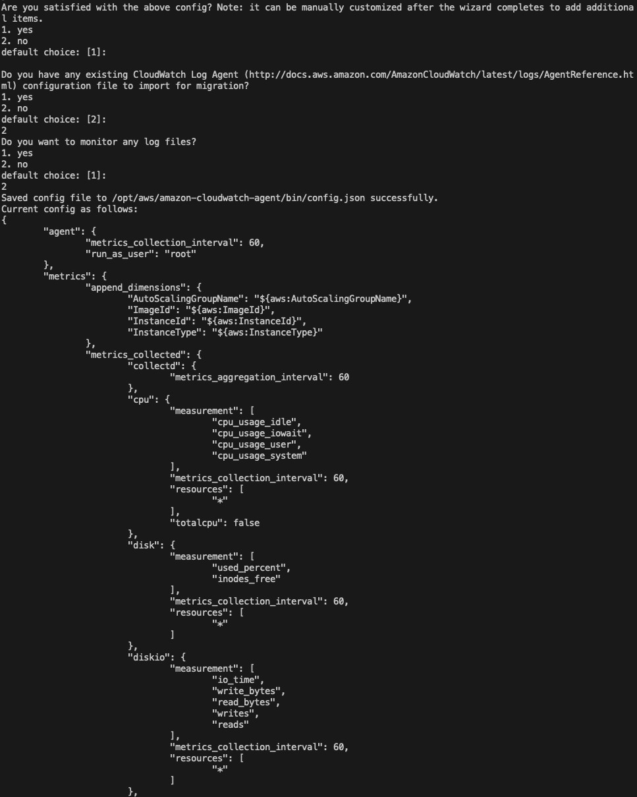

# 高阶19 在AWS上安装运行Alphafold v2进行蛋白质结构预测

> 最近AI界平地一声雷，DEEPMIND的Alphafold v2版本横空出世，最好的预测精度号称能达到结构生物学实验的测量精度，要知道这玩意儿可是上千万美金的冷冻电镜才能做出来的，一时间舆论大起，有认为划时代的，有认为没啥用的，唇枪舌剑不可开交。愚以为，有，总比没有好！
> -- D.C



本文转自AWS官方博客[在AWS上使用AlphaFold进行蛋白质结构预测](https://aws.amazon.com/cn/blogs/china/use-alphafold-for-protein-structure-prediction-on-aws/)，由于存在不可描述的原因，这个地址经常打不开，所以我就搬过来了。

## AlphaFold

AlphaFold是DEEPMIND开发的一个能根据蛋白质序列预测构象的深度学习模型，和两年前的一代目相比，AlphaFold2的主要变化是直接训练蛋白质结构的原子坐标，而不是用以往常用的、简化了的原子间距或者接触图。这也使得AlphaFold2在解析蛋白结构的速度上有了进一步的提高。

而在传统上，蛋白质结构预测可以分为基于模板和从头预测，但是AlphaFold2只用同一种方法—就是机器学习，对几乎所有的蛋白质都预测出了正确的拓扑学的结构，其中有大约2/3的蛋白质预测精度达到了结构生物学实验的测量精度。

2021年7月，DeepMind开源了升级版本AlphaFold v2.0，本文简要描述了如何在AWS上使用AlphaFold进行蛋白质结构预测。

本着是骡子是马，总要自己骑了才知道的朴素科学观，利用aws云端资源，可以快速构建出AlphaFold2的pipeline。


## **EC2实例设置**

- 运行AlphaFold需要安装Docker和NVIDIA Container Toolkit，我们可以启动一台运行ECS GPU-optimized AMI的EC2实例，以省去这些工具的安装操作：

- 启动EC2实例，搜索AMI: amzn2-ami-ecs-gpu-hvm-2.0.2021，选择最新的日期的版本(也可以从[这里](https://docs.aws.amazon.com/AmazonECS/latest/developerguide/ecs-optimized_AMI.html) 查询对于区域的最新Amazon Linux（GPU）AMI ID)


- 如果要使用NVIDIA A100则实例类型可选择p4d.24xlarge，本例测试选择具有4块NVIDIA V100 GPU的p3.8xlarge。


- 系统卷100G，增加一个3T的数据卷，卷类型均为gp3


- 实例创建完成后登录系统，格式化并挂载3T的数据盘到/data，具体操作参考[这个帖子：如何让 EC2 “妻妾成群”？挂载更多磁盘并实现自动挂载！](https://www.bioaws.com/blogs/2020-02-02-ec2-ebs-attach/)


## **数据库下载**

- 安装依赖

```
sudo rpm http://dl.fedoraproject.org/pub/epel/epel-release-latest-7.noarch.rpm
sudo yum install aria2 rsync git vim wget -y
```

- 修改/data目录权限

```
sudo chown ec2-user:ec2-user -R /data
```

- 克隆AlphaFold 代码库并进入alphafold目录 [github 地址](https://github.com/deepmind/alphafold)

```
git clone https://github.com/deepmind/alphafold.git
```

- 下载数据到/data，因为数据下载加解压可能需要十几个小时的时间，所以使用nohup让下载任务在后台执行

```
nohup scripts/download_all_data.sh /data &
```

完成之后在下载目录会有如下文件生成:

```bash
$DOWNLOAD_DIR/                          # Total: ~ 2.2 TB (download: 438 GB)
    bfd/                                   # ~ 1.7 TB (download: 271.6 GB)
        # 6 files.
    mgnify/                                # ~ 64 GB (download: 32.9 GB)
        mgy_clusters_2018_12.fa
    params/                                # ~ 3.5 GB (download: 3.5 GB)
        # 5 CASP14 models,
        # 5 pTM models,
        # LICENSE,
        # = 11 files.
    pdb70/                                 # ~ 56 GB (download: 19.5 GB)
        # 9 files.
    pdb_mmcif/                             # ~ 206 GB (download: 46 GB)
        mmcif_files/
            # About 180,000 .cif files.
        obsolete.dat
    small_fbd/                             # ~ 17 GB (download: 9.6 GB)
        bfd-first_non_consensus_sequences.fasta
    uniclust30/                            # ~ 86 GB (download: 24.9 GB)
        uniclust30_2018_08/
            # 13 files.
    uniref90/                              # ~ 58 GB (download: 29.7 GB)
        uniref90.fasta
```

## **运行AlphaFold**

- 创建输出目录

```
mkdir -p /tmp/alphafold
```

- 将docker/run_docker.py中的DOWNLOAD_DIR修改为包含下载数据库目录的路径/data, output_dir设置为上一步创建的输出目录



- 构建Docker镜像

```
docker build -f docker/Dockerfile -t alphafold .
```

完成后查看:


- 安装依赖

```
pip3 install -r docker/requirements.txt
```

- 测试文件

打开[这个网址](https://www.predictioncenter.org/casp14/target.cgi?target=T1050)，复制Sequence的文本到T1050.fasta文件中




- 运行可能需要几个小时时间，可以同样使用nohup命令让任务在后台执行

```
nohup python3 docker/run_docker.py --fasta_paths=T1050.fasta --max_template_date=2020-05-14 &
```

一个任务只能使用一块GPU，如果计算实例具有多块GPU，可以利用–gpu_devices参数将多个任务投递到不同的GPU上进行计算，如：

```
nohup python3 docker/run_docker.py --fasta_paths=T1050-1.fasta --max_template_date=2020-05-14 --gpu_devices=0 &

nohup python3 docker/run_docker.py --fasta_paths=T1050-2.fasta --max_template_date=2020-05-14 --gpu_devices=1 &
```

- 完成之后在之前设置的/tmp/alphafold目录下会有结果输出:



## 监控配置

我们可以通过CloudWatch来监控CPU、内存和GPU的使用率，其中CPU监控指标CloudWatch默认就支持，内存监控指标需要通过CloudWatch Agent来实现，GPU监控需要通过一个python程序来实现。

- IAM角色

新建一个具有ClooudWatchAgentServerPolicy权限的角色，取名CW-Role


将它附加到EC2实例上：


- CloudWatch Agent


1.安装

```
sudo yum install collectd amazon-cloudwatch-agent -y
```

2.执行如下命令并按提示进行配置，详见附录

```
sudo /opt/aws/amazon-cloudwatch-agent/bin/amazon-cloudwatch-agent-config-wizard
```

3.重新启动agent

```
sudo /opt/aws/amazon-cloudwatch-agent/bin/amazon-cloudwatch-agent-ctl -a fetch-config -m ec2 -s -c file:/opt/aws/amazon-cloudwatch-agent/bin/config.json
```

- GPU监控

1.下载python脚本

```
wget https://s3.amazonaws.com/aws-bigdata-blog/artifacts/GPUMonitoring/gpumon.py
```

2.vim gpumon.py

```
修改

### 选择区域 ####

EC2_REGION = 'us-east-1'

#在此处选择命名空间参数，名字可以随意取###

my_NameSpace = 'AlphaFold'

### 选择推送间隔 ####

sleep_interval = 10

### 选择存储精度 (在 1-60 之间) ####

store_reso = 60
```

3.安装python2的依赖

```
wget https://bootstrap.pypa.io/pip/2.7/get-pip.py

python get-pip.py

pip install nvidia-ml-py

pip install boto3
```

4.执行

```
nohup python gpumon.py &
```

- 查看CloudWatch

在CloudWatch的指标中可以发现CWAgent和AlphaFold两个命名空间，其中包含了我们所需要的内存和GPU监控指标:


创建一个控制面板来统一监控这些指标:


## 测试结果分析

- 运行命令

```
python3 docker/run_docker.py --fasta_paths=T1050.fasta --max_template_date=2020-05-14
```

结果如下：


只有在模型的推理阶段才会用到GPU，而且只用到了4块GPU中的一块，其余阶段都是用的CPU [查看 issue](https://github.com/deepmind/alphafold/issues/67)

- 投递两个任务

```
nohup python3 docker/run_docker.py --fasta_paths=T1050-1.fasta --max_template_date=2020-05-14 --gpu_devices=0 > a.out &

nohup python3 docker/run_docker.py --fasta_paths=T1050-2.fasta --max_template_date=2020-05-14 --gpu_devices=1 > b.out &
```

结果如下：



可以看到用到了2块GPU。

## 参考
更详细的AlphaFold使用请参考：https://github.com/deepmind/alphafold

## 一些配置信息

CloudWatch Agent配置示例





> 社会主流舆论往往是扼杀创新的，如果你有个好点子，你要有被长期误解的心理准备，坚持下去，时间会证明一切。
