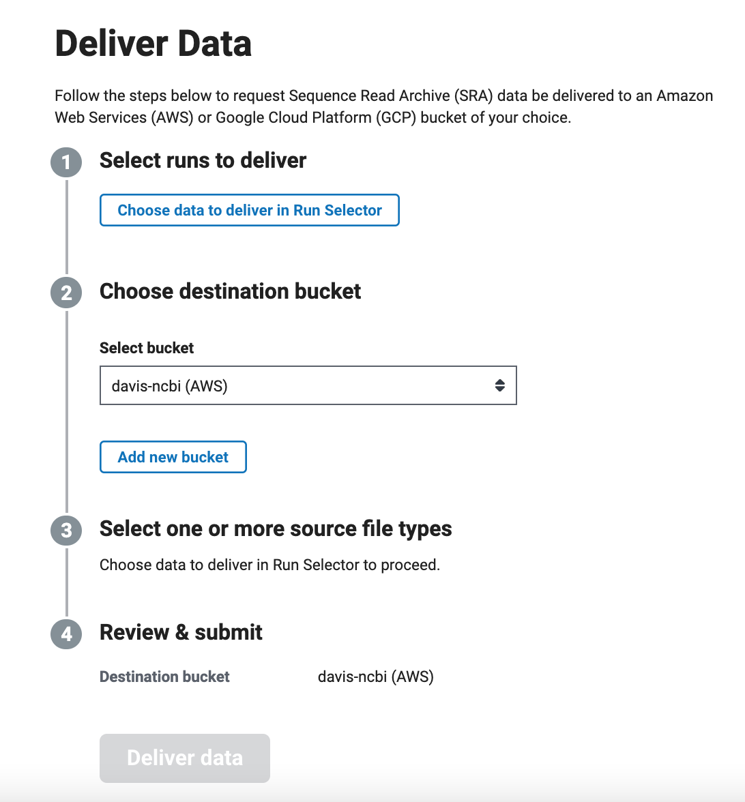
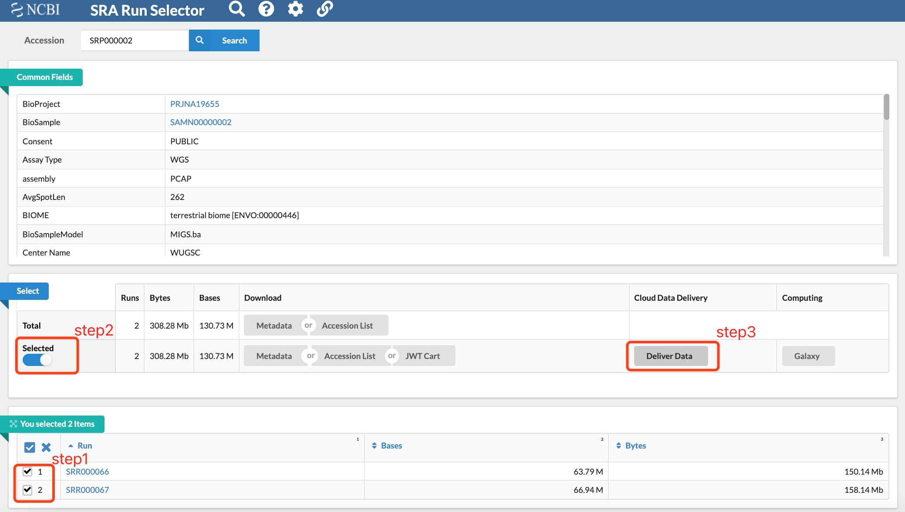
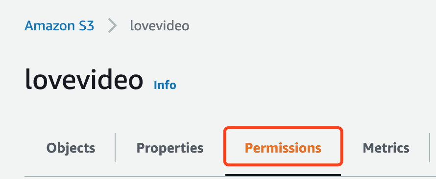

# 善物7 - NCBI上的数据直接导入AWS

> 云是未来，全世界有很多公开数据集保存在AWS上，称之为aws的opendata，NCBI自然不例外，
> 现在ncbi已经支持提供数据从他的S3桶直接导入到用户自己的S3桶。
> -- D.C

## 关于公开数据集

查看这篇帖子[入门系列14 福音！用好AWS公开数据集](https://www.bioaws.com/blogs/2020-02-09-aws-public-dataset/)

## 关于准备工作

- 知道你要的数据，废话
- 有个AWS海外账号
- 在弗吉尼亚区建个S3桶


## NCBI 上的数据

### 登录NCBI

登录NCBI[这个网址](https://www.ncbi.nlm.nih.gov/Traces/cloud-delivery/),点击log in，登录。



### 选中数据

点击 *Choose data to deliver in Run Selector* , 页面会跳转到data select 界面，假如说我选择这个数据 *SRP000002*,就会出现如下界面。



- step1: 勾选我们要下载的数据
- step2: 点击 *Selected*
- step3: 点击 *Deliver Data*

可以看到第一步选中数据已经完成。


### 设置S3桶

- 由于目前NCBI支持的AWS区域为 **弗吉尼亚区，US East (N. Virginia)** ，所以这里需要选择对应这个区的桶，比如我的叫 `lovevideo`,系统会同步生成一段 *桶策略*，用来给到我这个桶允许ncbi往里面推送数据的权限。


- 接下来copy这个桶策略，将其粘贴到AWS console界面的S3桶的permission里，点击 *Save Changes*。




### 确认数据类型

- 回到NCBI页面，进入下一步确认要copy的数据类型，然后点击 *Deliver data* 即可。


- 接着会跳出确认框，告诉我每个账户有个30天的周期limit：

```
NCBI will deliver 4 files (1.1 GB) to: lovevideo (AWS)
Your request to deliver the following data will count against your NCBI 30-day limits for complimentary data transfer*

Cold storage retrieval: 983.4 MB requested from remaining 10.0 TB
Cloud bucket delivery: 1.3 GB requested from remaining 40.0 TB
It may take up to 48 hours to deliver this data to your bucket. Once you submit your request, it cannot be paused or cancelled.
* 30-day rolling window limit for SRA data requests will reset 2021-09-21
```


### 等待数据的到来

官方说 *up to 48 hours*，实测几个小时我的桶就出现了数据，具体可能要看这个数据本身是不是已经被ncbi冻起来了。

### 数据回国

如果要将数据拉回国内的AWS分析，请参考这篇文章[高阶11 使用S3数据同步神器，数据尽在我手](https://www.bioaws.com/blogs/2020-08-20-sync_data_use_S3tools/)

或者，懒人一键部署版 [Data Replication Hub](https://github.com/awslabs/data-transfer-hub)，你没猜错，背后还是cloudformation ：）

完 & Enjoy~

> 总须脚踏实地，克勤小物，乃可日起而有功。
