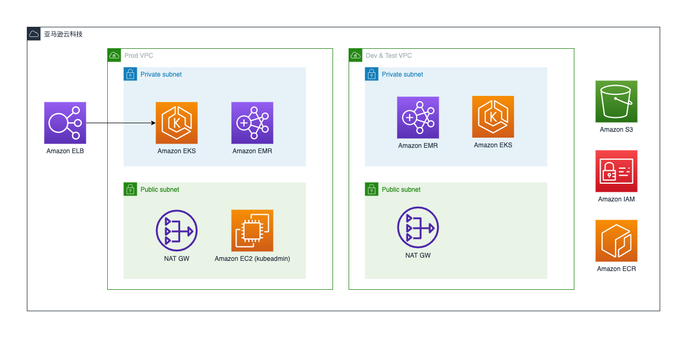

# 成功案例1-VEEVA的落地中国之路

> 行业内的同学相信对Veeva不会陌生，作为国际知名的制药及生命科学信息系统服务商，
> 为全球的制药MNC提供包括eTMF,CRM,KOL,主数据等一系列解决方案，在中国还提供SFA产品，对云的理解颇深。我们来看看它是如何利用AWS来加速业务的。
> -- D.C

## 关于Veeva

Veeva Systems（以下简称“Veeva”）成立于 2007 年，是全球生命科学行业基于云计算模式的解决方案创新者， 致力于提供创新的技术架构和专业的产品服务。秉承客户成功的理念，通过不断茁壮发展，Veeva 目前已形成研发云、商务云两条业务线，为全球超过 1200 家客户提供涵盖软件、数据、商业咨询等产品与服务，目前，全球前 50 强制药企业中的 47 家都在使用 Veeva 提供的产品与服务。

作为一家公共利益公司（PBC, Public Benefit Corporation），Veeva 以为生命科学行业打造行业云为愿景，帮助这一行业提高生产力，并在社区中创造高质量的就业机会。 Veeva China SFA 是Veeva 因地制宜、特别为中国市场设计的一款 SaaS 产品，为生命科学行业客户提供涵盖客户拜访管理、学术会议管理、销售运营、市场学术推广、医学信息传递等场景的完整解决方案。而 Veeva OpenData 数据服务则能帮助生命科学企业建立客户数据的标准化管理流程，提升客户相关部门的数据使用体验。

## 业务痛点和需求

市场竞争白热化，数据安全政策持续优化，医共体建设加速和医改政策加深，内部降本增效压力增加，合规压力进一步凸显……重重挑战下，生命科学企业正在纷纷寻找如何从不确定中求生存、抢先机的方法。Veeva 认为 “与中国市场同频”的产品和技术创新，才能真正赋能在中国市场发展的药企，帮他们应对挑战、突破发展。

从 2011 年进入中国以来，Veeva 就关注到中国生命科学行业独特的市场规则，其商业观念、市场行为、流程和用户体验与海外有着巨大差别。为了更好的服务跨国制药企业和本土创新药企，Veeva 决定筹建中国本地的产品研发中心，并于 2016 年开始设计本土化 SaaS 产品 China SFA，结合 OpenData 数据服务打造新一代适合中国市场的行业云，助力本地市场的药企客户成功。

**Veeva中国商务产品总经理靳越**认为，在本土创新和产品交付过程中，除要贴合中国市场的业务需求外，还需要关注两点：

- 重塑满足商业环境的技术架构：China SFA 作为一款本土化 SaaS 产品，不仅要沿用全球研发质量体系，更重要的是其底层云基础架构需要拥有全新的技术栈，能够与本地技术创新融合，如与企业微信、腾讯会议的集成，满足中国用户的使用习惯和体验；

- 强化数据安全合规能力建设：应用与数据都需要部署在中国境内的数据中心上，做到云上数据安全合规，确保客户在数据安全、个人信息保护和跨境传输等领域都能够符合中国信息安全法律法规的要求。

## 为什么选择AWS

Veeva本身产品体系是基于云端打造的，其海外就是用的AWS，且AWS的安全和合规是全球制药企业广泛认可的，包括FDA，EMA（欧盟药品管理局）等。

对于选择与亚马逊云科技合作，靳越也从三个方面作了解释。

- 第一，亚马逊云科技是 Veeva 全球合作伙伴，一直为 Veeva 提供稳定可靠、安全可信的云服务；

- 第二，亚马逊云科技的诸多技术规范已成为行业标准，可直接沿用而无需单独学习；

- 第三，双方的价值观高度契合，Veeva 的目标是通过技术创新，加速药企以高效、低成本的方式研发药物并进行上市营销。“我们不只在技术上都注重创新，双方在服务客户的底层逻辑上也非常一致，即以客户为中心，这是大家建立长远合作关系的前提。” 靳越介绍道。

### 未雨绸缪，抢先一步构建云中安全 “堡垒”

随着《数据安全法》、《关键信息基础设施安全保护条例》、《个人信息保护法》等系列法律法规的出台，中国对网络安全的高度重视和立法进程正在加速。如今，Veeva China SFA 已经通过由公安部颁发的网络安全等级保护（三级）认证，以确保产品符合中国信息安全规范和法律法规的要求，由此助力生命科学企业利用 China SFA 平台合规拓展中国市场业务。

目前，China SFA 和 OpenData 均部署在亚马逊云科技中国区，亚马逊云科技在云基础设施和云服务安全方面的优势，使 Veeva 得以快速高效的构建起整体的云中安全合规“堡垒”，应对来自网络攻击、竞争对手及内部信息安全等诸多风险的挑战。比如，针对应用层攻击进行防护的 Amazon WAF，允许 Veeva 根据自身业务自动创建、部署和维护安全规则，建立多层安全防护体系；针对亚马逊云科技账户和工作负载进行防护的 Amazon GuardDuty，允许 Veeva 持续监控其账户、Amazon EC2 实例、Amazon EKS 集群以及存储在 Amazon S3 中的数据是否存在恶意活动。

谈到最新发布的《数据出境安全评估办法》时，靳越表示，Veeva 对此早已做了相应的准备：“在 2016 年开始打造本土产品 China SFA 时，我们的数据中心就决定部署在亚马逊云科技中国区。我们还准备了一个快速部署包，帮助客户快速地迁移到本地系统上。”

在谈到亚马逊云科技安全层面提供的服务时，靳越表示，他欣赏亚马逊云科技首创的安全责任共担模型：“在这一模型中，Veeva 只需为自身云业务的安全负责，其余的云基础设施和云服务的安全合规全部交由亚马逊云科技负责，这些基础设施满足了包括等保三级测评在内的多项中国合规监管认证，让我们不用担心底层技术架构和服务的安全性。”

### 产品驱动，加速中国本土生命科学行业 SaaS 产品落地

Veeva China SFA 基于亚马逊云科技 Amazon Elastic Kubernetes Service (Amazon EKS)、Amazon Relational Database Service (Amazon RDS)、Amazon ElastiCache、Amazon OpenSearch Service 等产品和服务构建，是集合业务系统、服务、数据和基础平台为一体的移动 CRM 解决方案；OpenData 则采用亚马逊云科技的 Amazon EKS、Amazon Elastic MapReduce (Amazon EMR)等服务，为企业搭建起高质量的医学专业人士、医疗机构、附属机构及合规数据的信息数据库。

在开发过程中，Veeva 使用 SDK 接入亚马逊云科技，并且通过 Amazon CloudFormation 对基础设施代码化，从而提高技术架构复用率并降低运维成本。在数据分析应用层面，Veeva 利用 Amazon EKS 集群搭建了 China SFA 和 OpenData 完整的生产系统，并采用 Amazon EMR 完成了大数据分析。此外，在疫情期间，Veeva 还通过 Amazon WorkSpaces 预置了基于云的虚拟桌面，方便员工随时随地安全可靠地远程接入云环境。

## 采用的AWS服务

- Amazon EKS： 托管的Kubernetes [EKS](https://www.amazonaws.cn/eks/)
- Amazon RDS：托管的关系型数据库 [RDS](https://www.amazonaws.cn/rds/)
- Amazon EC2：云上服务器实例，这个大家应该都知道。
- Amazon ElastiCache：分布式内存数据存储或缓存,适用于亚毫秒级响应时间的应用 [ElastiCache](https://www.amazonaws.cn/elasticache/)
- Amazon OpenSearch：托管的OpenSearch 集群，为一系列使用场景（如日志分析、应用程序搜索、企业搜索，等等）轻松地提取、保护、搜索、聚合、查看以及分析数据。 [OpenSearch](https://aws.amazon.com/cn/opensearch-service/)
- Amazon SDK：基于code的云端开发工具, C++,Java,JavaScript,.Net,PHP,Python,Ruby,Eclipse,Visual Studio,PowerShell. 总有一款适合你。 [SDK](https://www.amazonaws.cn/en/tools/)
- Amazon CloudFormation：一键化部署云上基础设置，这个对各家云商底层的标准化要求很高。
- Amazon EMR：行业领先的云大数据平台，用于使用 Apache Spark、Apache Hive、Apache HBase、Apache Flink、Apache Hudi 和 Presto 之类的开源工具处理海量数据。 [EMR](https://www.amazonaws.cn/elasticmapreduce/)
- Amazon SageMaker：托管的云上机器学习工具套件，端到端解决方案，适用于每个开发人员和数据科学家。 [SageMaker](https://www.amazonaws.cn/sagemaker/)
- Amazon WAF：安全相关，Web 应用程序防火墙。可以和负载均衡搭配使用。[WAF](https://www.amazonaws.cn/waf/)
- Amazon GuardDuty：托管型威胁检测服务，可持续监控恶意活动和未经授权的行为。 [GuardDuty](https://www.amazonaws.cn/guardduty/)
- Amazon WorkSpaces： 托管的云端桌面 （Desktop as a service） [WorkSpaces](https://www.amazonaws.cn/workspaces/)

靳越认可亚马逊云科技的专业技术团队“客户至上”的专业态度：“在选择数据分析引擎时，亚马逊云科技架构师没有选择自有数仓产品进行推荐，而是根据实际的业务场景需求，推荐选择开源的列式数据库管理系统 ClickHouse，并将其直接部署在 Amazon Elastic Compute Cloud (Amazon EC2)环境中，帮助我们快速地完成项目迁移。”

近期，Veeva 还试用了亚马逊云科技全托管的机器学习服务 Amazon SageMaker，希望在 China SFA 以及 OpenData 等产品线上进行一些基于机器学习的创新业务尝试，比如检测识别医药代表上传的图片真伪、自动化从海量文本中提取 HCO 信息等。并且，Veeva 还计划实施 Amazon Lambda 无服务器技术来增加业务敏捷性，构建其他创新应用。

## 参考架构图

- Veeva China SFA 基于亚马逊云科技的系统架构示意图（值得注意的是，Veeva是典型的SaaS架构，而且很重视安全，一排的安全服务）

- Veeva OpenData 基于亚马逊云科技的系统架构示意图

## 收益

中国是 Veeva 全球最重要的市场之一，超过 100 家全球性的跨国制药企业和本土创新药企都在中国使用 Veeva 的产品。近两年，Veeva 中国的业务持续增长，其背后原因，与 Veeva 全力以赴投入中国行业云产品线的决心和行动密不可分。**在过去两年，Veeva 中国的产研团队人数翻了三倍，专注于本土化产品线 China SFA 的打造。以及基于 China SFA 每年 12 次的产品迭代，涵盖大量针对本土市场的产品功能。以过去一年为例，与中国市场相关的功能就上线了 900 多个。**

从技术角度看，使用亚马逊云科技后，Veeva 推进了 China SFA 和 OpenData 产品的研发和交付进程，开发、测试、运维效率获得显著提升，具体包括：

- 提升业务创新能力：亚马逊云科技拥有完善的云上服务，服务配置与机型种类丰富，且充分兼容第三方产品，可以为 Veeva 不同的产品线搭配最合适的方案，且服务按需计费，研发试错成本低，支持 Veeva 快速完成业务验证，提高产品迭代效率和业务创新能力；

- 简化运维、降本增效：通过 Amazon RDS 托管 MySQL，借助 Amazon EKS 托管 Kubernetes 服务，Veeva 的 IT 人员无需复杂操作，即可通过控制面板查看各个节点的运行情况，且费用明细清晰，简化了运维，并降低维护成本；

- 保障业务安全合规性：亚马逊云科技可靠的服务、高 SLA（服务级别协议）的承诺，确保 Veeva 业务安全稳定运行。亚马逊云科技的云平台采用冗余、多副本机制，专用企业级防火墙 Amazon WAF 可自定义安全等级部署，保障 Veeva 的 Web 应用程序免受攻击。

“通过与亚马逊云科技合作， Veeva 还获得了一个非常重要的收获，那就是激发了员工的积极性，”靳越表示，“我们的员工可以使用业界领先的云技术方案来解决问题，这将帮助团队在技术上越来越成熟，工作效率也越来越高，员工的成长是我们收获的最大财富。”

Veeva 的愿景是“为生命科学行业打造行业云”。未来，Veeva 希望继续应用亚马逊云科技更多的创新服务，探索更多全新的业务模式和方向，在遵循中国本土安全合规的基础上，为整个医药行业提供更适合中国市场的应用。

_官方案例Link：https://www.amazonaws.cn/en/customer-stories/health/veeva/_

> 博学切问，所以广知。
